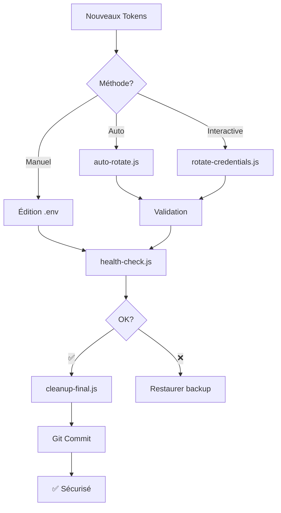

# 🔐 Système de Rotation des Credentials - Frankito-IA

## 🎉 Système Complet Installé !

Votre projet dispose maintenant d'un système professionnel de rotation des credentials avec **3 niveaux d'automatisation**.

---

## 🚀 Méthodes de Rotation

### ⚡ Niveau 1 : AUTO-ROTATE (Recommandé)

**Une seule commande, zéro interaction**

```bash
# Créer fichier avec vos nouveaux tokens
echo "TELEGRAM_BOT_TOKEN=votre_token" > new-creds.tmp
echo "N8N_API_KEY=votre_cle" >> new-creds.tmp

# TOUT est automatique
node auto-rotate.js --from-file=new-creds.tmp
```

**✅ Fait automatiquement :**
- Valide les 2 credentials
- Backup .env → .env.backup
- Update .env
- Lance health-check
- Supprime archive/
- Supprime new-creds.tmp
- Affiche commande git prête

**⏱️ Temps : 30 secondes**

---

### 🎯 Niveau 2 : ROTATE-CREDENTIALS (Interactif)

**Guidé étape par étape**

```bash
node rotate-credentials.js
```

**Interface interactive :**
- Demande token Telegram (masqué en `*****`)
- Valide immédiatement
- Demande clé N8N (masquée)
- Valide immédiatement
- Update .env automatiquement
- Lance health-check
- Affiche prochaines étapes

**⏱️ Temps : 2 minutes**

---

### 🔧 Niveau 3 : MANUEL (Fallback)

Si les scripts automatiques ne fonctionnent pas :

```bash
# 1. Éditer .env manuellement
nano .env

# 2. Valider
node health-check.js

# 3. Nettoyer
node cleanup-final.js
```

---

## 📦 Fichiers Créés

### Scripts Principaux

| Fichier | Description | Usage |
|---------|-------------|-------|
| **auto-rotate.js** | Rotation automatique complète | `node auto-rotate.js --from-file=...` |
| **rotate-credentials.js** | Rotation interactive guidée | `node rotate-credentials.js` |
| **health-check.js** | Diagnostic système complet | `node health-check.js` |
| **cleanup-final.js** | Nettoyage post-rotation | `node cleanup-final.js` |
| **config.js** | Configuration centralisée | Importé par tous les scripts |

### Utilitaires

| Fichier | Description |
|---------|-------------|
| **test-rotation-ui.js** | Test de l'interface (dry-run) |
| **new-creds.tmp.example** | Template pour fichier credentials |

### Documentation

| Fichier | Description |
|---------|-------------|
| **QUICK-START.md** | Guide rapide (3 commandes) |
| **ROTATION-GUIDE.md** | Guide complet avec troubleshooting |
| **README-ROTATION.md** | Ce fichier |

---

## 🎯 Quick Start (3 Étapes)

### 1. Obtenir les nouveaux tokens

**Telegram :**
```
@BotFather > /mybots > [Bot] > API Token > Revoke & Regenerate
```

**N8N :**
```
https://n8n.srv1289936.hstgr.cloud > Settings > API > Create API Key
```

### 2. Rotation automatique

```bash
echo "TELEGRAM_BOT_TOKEN=VOTRE_TOKEN" > new-creds.tmp
echo "N8N_API_KEY=VOTRE_CLE" >> new-creds.tmp
node auto-rotate.js --from-file=new-creds.tmp
```

### 3. Commit

```bash
# Commande affichée par auto-rotate.js, copiez-la directement
git add ... && git commit -m "..."
```

**C'EST TOUT !** 🎉

---

## 🛡️ Sécurité

### ✅ Protections en Place

- **Validation avant modification** - Si token invalide, .env pas touché
- **Backup automatique** - .env.backup créé avant chaque rotation
- **Cleanup automatique** - Fichiers temporaires toujours supprimés
- **.gitignore à jour** - .env jamais commité
- **Archive/ supprimée** - Anciennes credentials effacées

### ⚠️ Anciennes Credentials Exposées

Les tokens suivants ont été exposés dans Git :
- Token Telegram : `8510817329:AAE...`
- API Key N8N : `eyJhbGci...TjMZDacb9T_g44VPQ_jI`

**Actions effectuées :**
- ✅ Scripts refactorisés (config.js centralisé)
- ✅ .gitignore mis à jour
- ✅ Archive/ créée (sera supprimée après rotation)
- ⏳ **À FAIRE : Rotation des credentials**
- ⏳ **Optionnel : Nettoyage historique Git**

---

## 📊 Workflow Complet



---

## 🔍 Diagnostic

### Vérifier l'état actuel

```bash
node health-check.js
```

**Résultat attendu APRÈS rotation :**
```
✅ Fichier .env
✅ Configuration
✅ Connexion N8N
✅ Workflow Master
✅ Bot Telegram

✅ SYSTÈME OPÉRATIONNEL
```

### Tester sans rotation

```bash
node test-rotation-ui.js
```

---

## 🆘 Troubleshooting

### "Token invalide" pendant auto-rotate

**Problème :** Validation échoue

**Solution :**
1. Vérifiez que vous avez copié le token complet
2. Pas d'espaces avant/après
3. Token Telegram : 45+ caractères
4. N8N API Key : 200+ caractères

### .env corrompu

**Restaurer le backup :**
```bash
cp .env.backup .env
node health-check.js
```

### Fichier temporaire bloqué

**Supprimer manuellement :**
```bash
rm new-creds.tmp
rm secrets.txt
```

---

## 📚 Documentation Complète

- **Démarrage rapide** : [QUICK-START.md](QUICK-START.md)
- **Guide complet** : [ROTATION-GUIDE.md](ROTATION-GUIDE.md)
- **Configuration** : [config.js](config.js) avec commentaires
- **Template .env** : [.env.template](.env.template)

---

## 🎓 Exemples d'Utilisation

### Exemple 1 : Rotation rapide

```bash
# Une ligne pour tout faire
echo -e "TELEGRAM_BOT_TOKEN=123:ABC\nN8N_API_KEY=eyJh..." > new-creds.tmp && node auto-rotate.js --from-file=new-creds.tmp
```

### Exemple 2 : Avec arguments CLI

```bash
node auto-rotate.js \
  --telegram="1234567890:ABCdefGHIjklMNOpqrsTUVwxyz" \
  --n8n="eyJhbGciOiJIUzI1NiIsInR5cCI6IkpXVCJ9..."
```

### Exemple 3 : Rotation interactive

```bash
# Interface guidée
node rotate-credentials.js
# Suivez les instructions à l'écran
```

---

## ✅ Checklist Post-Rotation

```
☐ Rotation effectuée (auto-rotate.js ou rotate-credentials.js)
☐ Health-check ✅ (SYSTÈME OPÉRATIONNEL)
☐ Archive/ supprimée
☐ .env.backup créé
☐ Fichiers temporaires supprimés
☐ Git commit effectué
☐ [OPTIONNEL] Historique Git nettoyé avec BFG
☐ Anciennes credentials révoquées dans @BotFather et N8N
```

---

## 🎉 Félicitations !

Votre système est maintenant :
- ✅ **Sécurisé** - Credentials centralisées et protégées
- ✅ **Robuste** - Validation et backup automatiques
- ✅ **Maintenable** - Un seul fichier config.js
- ✅ **Professionnel** - Outils de rotation automatisés

**Prochaine étape :** Lancez votre rotation !

```bash
node auto-rotate.js --from-file=new-creds.tmp
```

---

**Version :** 1.0.0
**Dernière mise à jour :** 2026-02-07
**Support :** Consultez ROTATION-GUIDE.md pour aide détaillée
